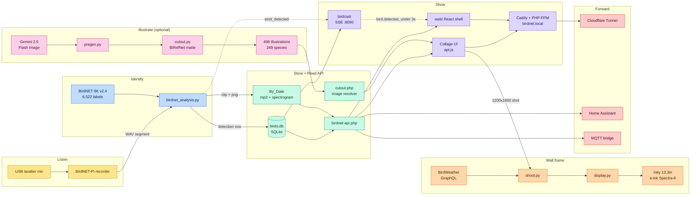

<!-- ░░░ Belkins BirdNET ░░░ -->
<p align="center">
  
</p>

<h1 align="center">Belkins BirdNET</h1>
<p align="center"><em>A live, hand-illustrated collage of the birds outside your window — named by ear.</em></p>

<p align="center">
  
  
  
  
</p>

<p align="center">
  
  
  
  
  
  
</p>

<p align="center">
  
</p>

---

## 🐦 What it is

A single $17 USB microphone in your window turns the birds outside into a **living collage**. Belkins BirdNET listens through the mic, lets **Cornell's BirdNET** name every passing call, and blooms each species onto the screen as a hand-painted *kachō-e* illustration — sized by how often it's been heard and repainted within seconds of each new detection.

498 bundled illustrations across 249 species, a Gemini pipeline to restyle them for *your* region, an optional e-ink frame for your wall — and one read-only SQLite file at the heart of it all.

> Belkins BirdNET is a standalone, deeply-rebranded build of [**BirdNET-Pi**](https://github.com/Nachtzuster/BirdNET-Pi). License and full Cornell attribution are [below](#-license).

<p align="center">
  
</p>

<p align="center">
  
  
  
  
  
  
  
</p>
<p align="center"><sub>A handful of the 498 bundled <em>kachō-e</em> illustrations — every species ships in a perched <strong>and</strong> a flight pose.</sub></p>

---

## 🗺️ How it works

From a microphone in the window to a hand-painted bird on the wall — every arrow is real data flow.



<table>
<tr>
<td align="center"><strong>498</strong><br/><sub>bundled illustrations</sub></td>
<td align="center"><strong>249</strong><br/><sub>species (perched + flight)</sub></td>
<td align="center"><strong>6,522</strong><br/><sub>BirdNET model labels</sub></td>
<td align="center"><strong>under 3s</strong><br/><sub>detection → screen</sub></td>
</tr>
<tr>
<td align="center"><strong>158</strong><br/><sub>photo-cutout fallbacks</sub></td>
<td align="center"><strong>3</strong><br/><sub>off-LAN forwarding recipes</sub></td>
<td align="center"><strong>13.3"</strong><br/><sub>Spectra-6 e-ink panel</sub></td>
<td align="center"><strong>~$70</strong><br/><sub>mic + Pi build cost</sub></td>
</tr>
</table>

<p align="center">
  
</p>

---

## 🛠️ Bill of materials

| Qty | Description | Price | Link | Notes |
|-----|-------------|-------|------|-------|
| 1 | Raspberry Pi (4B / 5 / Zero 2 W) | ~$35–80 | [Amazon](https://amzn.to/43yLDZJ) | [RPi0W2 note](https://github.com/mcguirepr89/BirdNET-Pi/wiki/RPi0W2-Installation-Guide) |
| 1 | Micro SD card (≥32 GB) | ~$10 | [Amazon](https://amzn.to/4eGy7te) | |
| 1 | USB lavalier microphone | $16.95 | [Amazon](https://amzn.to/4vLSaMK) | |
| 1 | Pi power supply | ~$10 | — | |

Optional: a [Gemini API key](https://aistudio.google.com/apikey) to restyle illustrations, and an [eBird API key](https://ebird.org/api/keygen) to filter species by region.

---

## 🚀 Quickstart

### 1 · Flash the SD card

Use [Raspberry Pi Imager](https://www.raspberrypi.com/software/) → Raspberry Pi OS Lite (64-bit). In the customisation dialog set a **username**, **WiFi SSID + password**, hostname `birdnet`, and enable **SSH with password auth**. Plug the USB mic into the Pi, place the capsule in a window, and boot.

### 2 · Run the installer

> Assumes passwordless sudo (the Raspberry Pi OS Lite default).

```bash
ssh <your-username>@birdnet.local
curl -s https://raw.githubusercontent.com/Belkins/belkins-birdnet/main/newinstaller.sh | bash
```

Clones this repo, installs BirdNET-Pi, and symlinks the Belkins BirdNET overlay into the Caddy web root. Takes 20–40 minutes and reboots when done.

- **Collage:** `http://birdnet.local/`
- **Stock BirdNET-Pi UI:** `http://birdnet.local/index.php`
- The menu button (top-right) opens an admin overlay with settings, system, log, and tool panels.

### 3 · (Optional) Restyle the illustrations

The repo ships with 498 bundled illustrations. To restyle them or generate a set for your own region:

```bash
pip install -r ~/BirdNET-Pi/avian/scripts/requirements.txt
export GEMINI_API_KEY='your-key'   # image generation requires billing enabled

# generate on a cream ground → cut the ground off → rebuild the collage masks
python3 ~/BirdNET-Pi/avian/scripts/pregen.py --labels ~/BirdNET-Pi/model/labels.txt --force
python3 ~/BirdNET-Pi/avian/scripts/cutout.py
python3 ~/BirdNET-Pi/avian/scripts/build_masks.py
```

Filter to your region with `--ebird-region US-CA` (needs `EBIRD_API_KEY`). The full pipeline, prompt, reference images, and per-species tuning live in [`avian/scripts/README.md`](avian/scripts/README.md); the style lives in [`prompt.template.md`](avian/scripts/prompt.template.md).

---

## ⚡ Realtime (birdcast)

New work in this build: a stdlib **Server-Sent-Events** spine so detections paint the instant BirdNET writes them.

- [`avian/realtime/birdcast.py`](avian/realtime/) — `POST /emit` in, `GET /events` out, ~500-event replay ring buffer, reads `birds.db` read-only.
- [`web/`](web/) — a Vite + React + TypeScript collage shell that seeds from the snapshot API, subscribes to the SSE stream, and paints in each new bird (Canvas2D fade + scale, no re-pack). Runs with **no backend at all** via `npm run dev:mock`.

```bash
# on the Pi — additive, idempotent, non-destructive
bash deploy-realtime.sh
```

---

## 📡 Forward off your LAN

Three independent recipes in [`avian/forwarding/`](avian/forwarding/):

- **Cloudflare Tunnel** — a public HTTPS URL with no port-forwarding.
- **Home Assistant** — a REST sensor exposing the latest detection.
- **MQTT bridge** — publishes every new detection to your broker.

---

## 🖼️ Wall frame

An optional e-ink frame mirrors the last 24h of birds onto a panel by your window. Build it from [`frame/`](frame/README.md). It can run off your own BirdNET mic, or **standalone from BirdWeather** for any ZIP code with no mic at all.

<p align="center">
  
  
</p>

---

## 📂 Repo layout

```
avian/                  # everything Belkins BirdNET adds to BirdNET-Pi
├── frontend/           # static HTML/JS/CSS for the collage
├── assets/             # 498 bundled illustrations + photo-cutout fallbacks
├── api/                # PHP shims served by BirdNET-Pi's PHP-FPM
├── scripts/            # generate → cutout → masks pipeline + prompt
├── realtime/           # birdcast SSE spine (POST /emit, GET /events)
└── forwarding/         # optional HA / MQTT / Cloudflare configs
web/                    # next-gen React + TS collage shell (live SSE)
frame/                  # optional e-ink wall display
```

Everything outside `avian/`, `web/`, and `frame/` is upstream BirdNET-Pi.

---

## 📜 License

CC-BY-NC-SA-4.0, inherited from [BirdNET-Pi](https://github.com/Nachtzuster/BirdNET-Pi/blob/main/LICENSE). **Non-commercial use only.** See the [BirdNET-Pi README](https://github.com/Nachtzuster/BirdNET-Pi/blob/main/README.md) for full Cornell attribution.

> BirdNET-Lite and the BirdNET model are © the **K. Lisa Yang Center for Conservation Bioacoustics, Cornell Lab of Ornithology**. BirdNET-Pi is © Patrick McGuire. Belkins BirdNET is a derivative work distributed under the same CC-BY-NC-SA-4.0 terms — see [`LICENSE`](LICENSE).

---

<p align="center">
  
</p>

<p align="center">
  <a href="https://github.com/Belkins/belkins-birdnet/fork">Fork</a> ·
  <a href="https://github.com/Belkins/belkins-birdnet/subscription">Watch</a> ·
  <a href="https://github.com/Belkins/belkins-birdnet/issues/new">Open an issue</a>
</p>

<p align="center"><sub>Made by Belkins · built on the shoulders of BirdNET-Pi and the Cornell Lab of Ornithology.</sub></p>
